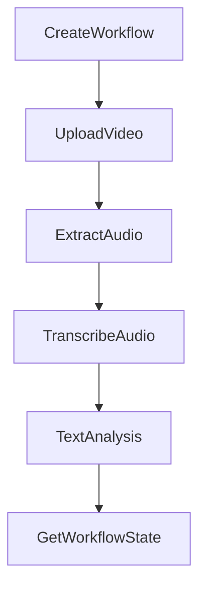

# OpenAPI Specifications for Azure AI Foundry Actions

This directory contains OpenAPI 3.0.3 specifications for Video Transcription Agent actions that can be used in Azure AI Foundry.

## Structure

Each JSON file in this directory represents a **separate Azure AI Foundry Action**. The filename corresponds exactly to the Action name that should be used when creating actions in Azure AI Foundry.

### Individual Action Files

| File | Action Name | Description | Operations |
|------|-------------|-------------|------------|
| `CreateWorkflow.json` | **CreateWorkflow** | Creates a new workflow (immediate) | `POST /workflow` |
| `UploadVideo.json` | **UploadVideo** | Starts video upload job from URL (returns job_id) | `POST /upload-video` |
| `ExtractAudio.json` | **ExtractAudio** | Starts audio extraction job (returns job_id) | `POST /extract-audio` |
| `TranscribeAudio.json` | **TranscribeAudio** | Starts transcription job using Whisper (default) or Azure Speech (returns job_id) | `POST /transcribe-audio` |
| `TextAnalysis.json` | **TextAnalysis** | All text processing operations (mixed: job-based + immediate) | `POST /enhance-transcription` (job)<br>`POST /summarize-content` (immediate)<br>`POST /extract-key-points` (immediate)<br>`POST /analyze-sentiment` (immediate)<br>`POST /identify-topics` (immediate) |
| `JobManagement.json` | **GetJobStatus / CancelJob** | Job management operations | `GET /jobs/{job_id}`<br>`POST /jobs/{job_id}/cancel` |
| `GetWorkflowState.json` | **GetWorkflowState** | Retrieves the current state of a workflow | `GET /workflow/{workflow_id}` |
| `HealthCheck.json` | **HealthCheck** | Checks service health and capabilities | `GET /health` |


## Azure AI Foundry Integration

### Creating Actions

When creating actions in Azure AI Foundry:

1. **Action Name**: Use the filename (without `.json`) as the Action name
   - Example: `CreateWorkflow.json` → Action name: `CreateWorkflow`

2. **OpenAPI Specification**: Upload the corresponding JSON file as the OpenAPI spec

3. **Operations**: Each action can have one or more operations (HTTP endpoints)
   - Single operation actions: `CreateWorkflow`, `UploadVideo`, etc.
   - Multi-operation actions: `TextAnalysis` (5 operations), `GetWorkflowState` (1 operation)

### Typical Workflow

A complete video transcription workflow in Azure AI Foundry would use these actions in sequence:



**Step-by-step:**
1. **CreateWorkflow** - Get a `workflow_id` (immediate)
2. **UploadVideo** - Start video download job, get `job_id`
3. **GetJobStatus** - Poll job until completion, then continue
4. **ExtractAudio** - Start audio extraction job, get `job_id`
5. **GetJobStatus** - Poll job until completion, then continue
6. **TranscribeAudio** - Start transcription job, get `job_id`
7. **GetJobStatus** - Poll job until completion, then continue
8. **TextAnalysis** - Use `/enhance-transcription` (job-based) for enhancement, get `job_id`
9. **GetJobStatus** - Poll enhancement job until completion
10. **TextAnalysis** - Use other operations (`/summarize-content`, `/extract-key-points`, etc.) for immediate analysis
11. **GetWorkflowState** - Check final results using `workflow_id`

**Job-Based Pattern:**
- Long-running operations now return `job_id` immediately (202 Accepted)
- Poll `GET /jobs/{job_id}` every 2-5 seconds for progress
- Cancel jobs with `POST /jobs/{job_id}/cancel` if needed
- Proceed to next step when job status becomes 'completed'

## Key Features

### Stateless Architecture
- All actions are stateless and atomic
- State is managed via `workflow_id` parameter
- Files are handled by reference in temporary storage
- Automatic cleanup after processing

### Whisper Integration
- **TranscribeAudio** defaults to local Whisper processing
- Automatic fallback to Azure Speech Services
- Quality settings: `fast`, `balanced`, `accurate`, `best`
- Language detection and override support
- Automatic model downloads

### Authentication
Two authentication methods supported:
- **API Key**: `X-API-Key` header for direct REST access
- **Azure Managed Identity**: Automatic for Azure AI Foundry agents

### Error Handling
Consistent error responses across all actions:
- `400` - Bad Request (validation errors)
- `401` - Unauthorized (authentication required)
- `404` - Not Found (workflow/resource not found)
- `500` - Internal Server Error

## Production Endpoint

All actions point to the production API server:
```
https://video-transcribe-api.calmocean-ce622c12.eastus2.azurecontainerapps.io
```

## Action-Specific Notes

### CreateWorkflow
- **Required first step** for all workflows
- No parameters needed
- Returns `workflow_id` for subsequent operations

### UploadVideo
- Requires `workflow_id` from CreateWorkflow
- Downloads video from any accessible URL
- Stores video reference for audio extraction

### ExtractAudio
- Requires completed UploadVideo step
- Uses FFmpeg for audio extraction
- Automatically cleans up video file after extraction

### TranscribeAudio
- **NEW**: Defaults to local Whisper processing
- Quality settings map to Whisper models:
  - `fast` → `tiny` model (~39MB)
  - `balanced` → `base` model (~74MB) 
  - `accurate` → `small` model (~244MB)
  - `best` → `medium` model (~769MB)
- Language detection or manual override
- Azure Speech Services fallback
- Automatic model downloads as needed

### TextAnalysis
- **Multi-operation action** with 5 text processing endpoints in one file
- **Mixed behavior**: `/enhance-transcription` is job-based (returns job_id), others are immediate
- Enhancement should be run first, then analysis operations can run in parallel
- All operations require transcribed text in workflow state

### GetWorkflowState  
- Retrieves complete workflow status
- Shows step-by-step progress and results
- Useful for monitoring long-running workflows

## Development Notes

### Updating Specifications
- Individual action files should be kept in sync with API implementation
- Complete API file should be regenerated when individual actions change
- All specs use OpenAPI 3.0.3 format

### Testing Actions
Use the `/health` endpoint to verify service availability before creating workflows:
```bash
curl https://video-transcribe-api.calmocean-ce622c12.eastus2.azurecontainerapps.io/health
```

### Version Information
- Current API version: `2.0.0-stateless`
- Architecture: Stateless workflow-managed
- Last updated: 2025-09-19
